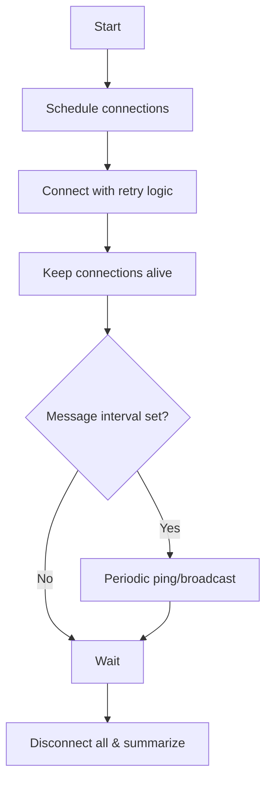

# Socket.IO Performance Benchmark Report

::: tip Quick glance
Use the sidebar to jump to 5k/10k/20k/32k. Tables include RAM vs connections and per-batch coverage.
:::

## 🖥️ System Environment <Badge type="info" text="env" />

### Hardware Specifications
| Component | Specification |
|-----------|---------------|
| **Processor** | Apple M1 (8 cores) |
| **Memory** | 16 GB RAM |
| **Storage** | Apple SSD AP0256Q (256GB) |
| **Available Space** | 50.57 GB |
| **Operating System** | macOS (Darwin 25.0.0) |
| **Architecture** | Apple Silicon (ARM64) |

### System Limits
| Resource | Limit | Impact on Socket.IO |
|----------|-------|-------------------|
| **File Descriptors** | 1,048,575 | Critical for connection capacity |

---

## 🧪 Test Architecture <Badge type="tip" text="workflow" />

### Client Workflow
Creates Socket.IO clients up to target count with throttled connection rate. Each client connects with retry logic (exponential backoff), maintains connections for configured duration, and optionally sends periodic messages to random subsets.

---

## 📊 Performance Results (5,000 Connections) <Badge type="tip" text="5k" />

### 🚀 Connection Performance
| Metric | Value | Unit |
|--------|-------|------|
| **Target Connections** | 5000 | conn |
| **Throughput (configured)** | 500 | conn/s |
| **Reported Connection Rate** | 287.97 | conn/s |
| **Ramp Duration** | 17.36 | s |
| **Avg Connection Time** | 1094 | ms |
| **Peak Memory Usage** | 286 | MB |
| **Memory per Connection (approx)** | 59 | KB |
| **Theoretical Max Connections** | 35800 | conn |
| **Grade** | A+ | - |

### 💾 RAM vs Connections (server rss)
| Connections | RAM rss (MB) |
|-------------|---------------|
| 0 | 125.78 |
| 1000 | 136.36 |
| 2500 | 169.86 |
| 4000 | 210.86 |
| 5000 | 222.53 |

### ✉️ Message Performance  
| Metric | Value |
|--------|-------|
| Broadcasts Sent | 120 |
| Total Messages Received | 599,880 |
| **Message Delivery Rate** | **100%** |
| Data Sent | 0.60 MB |
| Data Received | 2,998.8 MB |
| Avg Data per Connection | 585.7 KB |

Per-batch message coverage (10 samples)
| Batch | Expected | Received | Coverage |
|-------|----------|----------|----------|
| 1     | 4,999    | 4,999    | 100.0%   |
| 2     | 4,999    | 4,999    | 100.0%   |
| 3     | 4,999    | 4,999    | 100.0%   |
| 4     | 4,999    | 4,999    | 100.0%   |
| 5     | 4,999    | 4,999    | 100.0%   |
| 6     | 4,999    | 4,999    | 100.0%   |
| 7     | 4,999    | 4,999    | 100.0%   |
| 8     | 4,999    | 4,999    | 100.0%   |
| 9     | 4,999    | 4,999    | 100.0%   |
| 10    | 4,999    | 4,999    | 100.0%   |

### 📈 System Capacity
- **Peak Memory Usage:** 286 MB
- **Theoretical Max Connections:** 35,800
- **Current Utilization:** 14% of theoretical maximum

---

## 📊 Performance Results (10,000 Connections) <Badge type="tip" text="10k" />

### 🚀 Connection Performance
| Metric | Value | Unit |
|--------|-------|------|
| **Target Connections** | 10000 | conn |
| **Throughput (configured)** | 500 | conn/s |
| **Reported Connection Rate** | 291.39 | conn/s |
| **Ramp Duration** | 34.32 | s |
| **Avg Connection Time** | 1013 | ms |
| **Peak Memory Usage** | 379.5 | MB |
| **Memory per Connection (approx)** | 39 | KB |
| **Theoretical Max Connections** | 53973 | conn |
| **Grade** | A+ | - |

### 💾 RAM vs Connections (server rss)
| Connections | RAM rss (MB) |
|-------------|---------------|
| 0 | 201.55 |
| 1000 | 166.48 |
| 2500 | 175.50 |
| 4000 | 194.84 |
| 5000 | 211.38 |
| 6500 | 240.47 |
| 8000 | 293.30 |
| 9500 | 308.77 |
| 10000 | 318.28 |

### ✉️ Message Performance  
| Metric | Value |
|--------|-------|
| Broadcasts Sent | 118 |
| Total Messages Received | 1,169,883 |
| **Message Delivery Rate** | **99.2%** |
| Data Sent | 0.60 MB |
| Data Received | 5,998.2 MB |
| Avg Data per Connection | 585.76 KB |

Per-batch message coverage (10 samples)
| Batch | Expected | Received | Coverage |
|-------|----------|----------|----------|
| 1     | 9,999    | 9,999    | 100.0%   |
| 2     | 9,999    | 9,999    | 100.0%   |
| 3     | 9,999    | 9,999    | 100.0%   |
| 4     | 9,999    | 9,999    | 100.0%   |
| 5     | 9,999    | 9,999    | 100.0%   |
| 6     | 9,999    | 9,999    | 100.0%   |
| 7     | 9,999    | 9,999    | 100.0%   |
| 8     | 9,999    | 9,999    | 100.0%   |
| 9     | 9,999    | 9,999    | 100.0%   |
| 10    | 9,999    | 9,999    | 100.0%   |

---

## 📊 Performance Results (20,000 Connections) <Badge type="warning" text="20k" />

### 🚀 Connection Performance
| Metric | Value | Unit |
|--------|-------|------|
| **Target Connections** | 20000 | conn |
| **Throughput (configured)** | 500 | conn/s |
| **Reported Connection Rate** | 280.19 | conn/s |
| **Ramp Duration** | 71.38 | s |
| **Avg Connection Time** | 1078 | ms |
| **Peak Memory Usage** | 543.6 | MB |
| **Memory per Connection (approx)** | 28 | KB |
| **Theoretical Max Connections** | 75355 | conn |
| **Grade** | A+ | - |

### 💾 RAM vs Connections (server rss)
| Connections | RAM rss (MB) |
|-------------|---------------|
| 0           | 87.30         |
| 6000        | 238.98        |
| 10309       | 340.03        |
| 15000       | 411.09        |
| 20000       | 541.14        |

### ✉️ Message Performance  
| Metric | Value |
|--------|-------|
| Broadcasts Sent | 55 |
| Total Messages Received | 1,079,946 |
| **Message Delivery Rate** | **98.2%** |
| Avg Data per Connection | 585.79 KB |

Per-batch message coverage (10 samples)
| Batch | Expected | Received | Coverage |
|-------|----------|----------|----------|
| 1     | 19,999   | 19,999   | 100.0%   |
| 2     | 19,999   | 19,999   | 100.0%   |
| 3     | 19,999   | 19,600   | 98.0%    |
| 4     | 19,999   | 19,999   | 100.0%   |
| 5     | 19,999   | 19,999   | 100.0%   |
| 6     | 19,999   | 19,999   | 100.0%   |
| 7     | 19,999   | 19,600   | 98.0%    |
| 8     | 19,999   | 19,999   | 100.0%   |
| 9     | 19,999   | 19,999   | 100.0%   |
| 10    | 19,999   | 19,999   | 100.0%   |

### 📈 System Capacity
- **Peak Memory Usage:** 543.6 MB
- **Theoretical Max Connections:** 75,355
- **Current Utilization:** 26.5% of theoretical maximum

---

## 📊 Performance Results (32,000 Connections) <Badge type="warning" text="32k" />

### 🚀 Connection Performance
| Metric | Value | Unit |
|--------|-------|------|
| **Target Connections** | 32000 | conn |
| **Throughput (configured)** | 500 | conn/s |
| **Reported Connection Rate** | 200.08 | conn/s |
| **Ramp Duration** | 159.94 | s |
| **Avg Connection Time** | 1552 | ms |
| **Peak Memory Usage** | 745.7 | MB |
| **Memory per Connection (approx)** | 24 | KB |
| **Theoretical Max Connections** | 87881 | conn |
| **Grade** | A | - |

### 💾 RAM vs Connections (server rss)
| Connections | RAM rss (MB) |
|-------------|---------------|
| 0           | 125.50        |
| 8000        | 280.53        |
| 12000       | 340.36        |
| 15000       | 411.09        |
| 20000       | 541.14        |
| 29677       | 658.11        |
| 32000       | 745.70        |

### ✉️ Message Performance  
| Metric | Value |
|--------|-------|
| Broadcasts Sent | 100 |
| Total Messages Received | 2,966,462 |
| **Message Delivery Rate** | **77.3%** |
| Avg Data per Connection | 452.56 KB |

Per-batch message coverage (10 samples)
| Batch | Expected | Received | Coverage |
|-------|----------|----------|----------|
| 1     | 31,999   | 31,999   | 100.0%   |
| 2     | 31,999   | 31,999   | 100.0%   |
| 3     | 31,999   | 31,999   | 100.0%   |
| 4     | 31,999   | 31,999   | 100.0%   |
| 5     | 31,999   | 31,999   | 100.0%   |
| 6     | 31,999   | 31,500   | 98.4%    |
| 7     | 31,999   | 29,900   | 93.4%    |
| 8     | 31,999   | 27,700   | 86.6%    |
| 9     | 31,999   | 26,000   | 81.3%    |
| 10    | 31,999   | 24,700   | 77.2%    |

### 📈 System Capacity
- **Peak Memory Usage:** 745.7 MB
- **Theoretical Max Connections:** 87,881
- **Current Utilization:** 36.4% of theoretical maximum