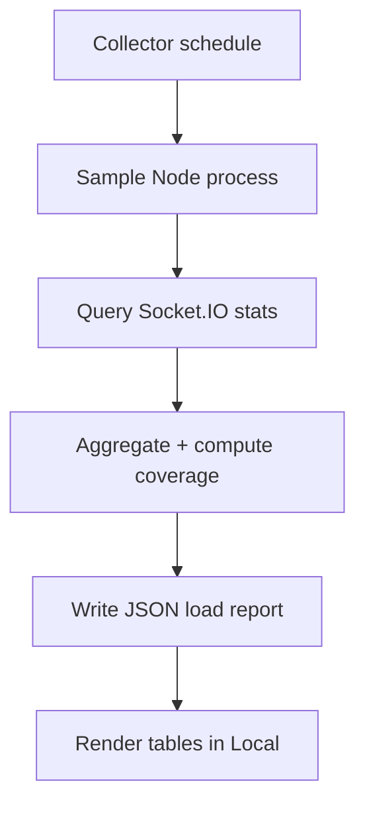

# Realtime Processor

Collects metrics (RAM, CPU, connections, coverage) and writes load reports used in Local Benchmarks.

## Sections

- 🔧 Architecture
- 📈 Metrics collected
- 🧪 Test cases
- 🔗 See: [/local/](/local/) for results

## 🔧 Architecture



## 📈 Metrics collected

- RAM: rss, heapUsed, heapTotal, external, arrayBuffers
- CPU: peak, average (interval-based)
- Connections: total, per-namespace
- Messages: expected vs received, per-batch coverage

## 🧪 Test cases

Use the benchmark CLI to drive scenarios; reports are generated alongside.

```bash
npm run test:10k
npm run test:20k
```
