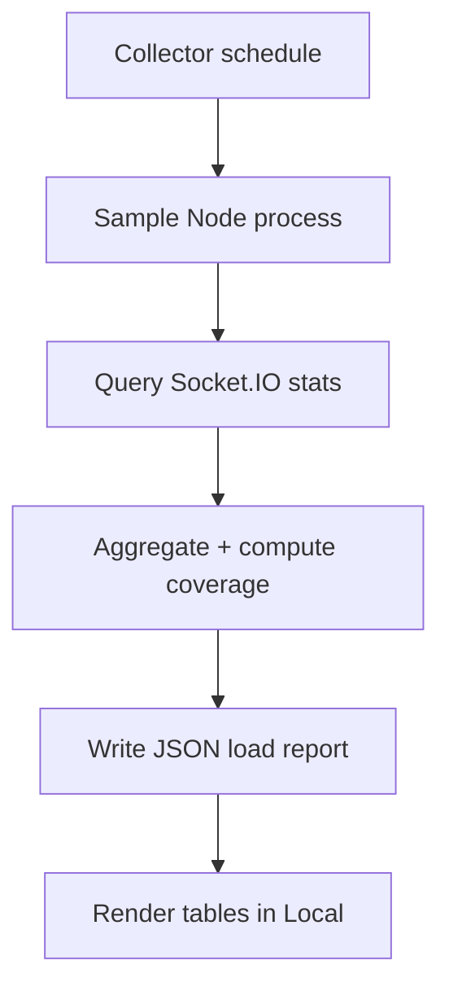
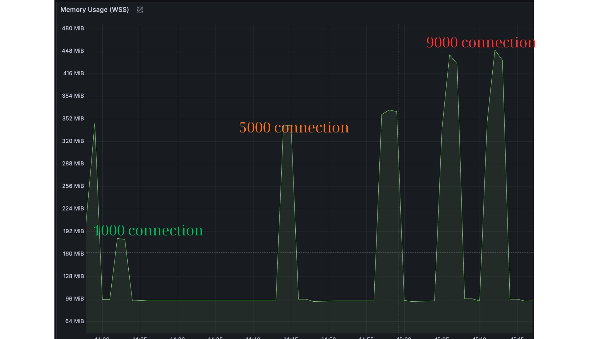
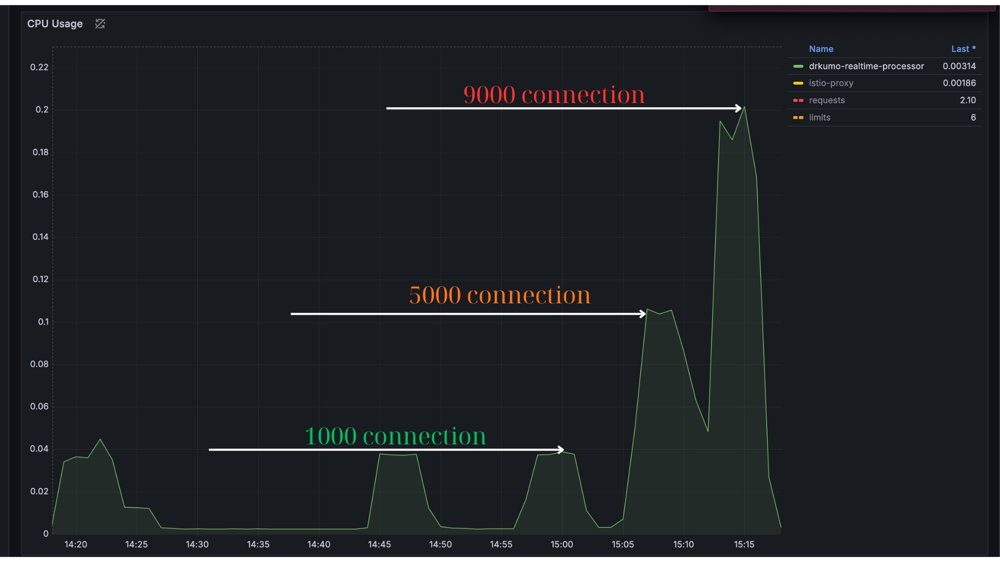

# Realtime Processor

Collects metrics (RAM, CPU, connections, coverage) and writes load reports used in Local Benchmarks.

## Sections

- 🔧 Architecture
- 📈 Metrics collected
- 🧪 Test cases
- 🔗 See: [/local/](/local/) for results

## 🔧 Architecture {#architecture}



## 📈 Metrics collected {#metrics-collected}

- RAM: rss, heapUsed, heapTotal, external, arrayBuffers
- CPU: peak, average (interval-based)
- Connections: total, per-namespace
- Messages: expected vs received, per-batch coverage

## 🧪 Test cases {#test-cases}

Use the benchmark CLI to drive scenarios; reports are generated alongside.

```bash
npm run test:10k
npm run test:20k
```

---

## 🚀 Pod Overview (d5) {#pod-overview}

| Component | Specification |
|-----------|---------------|
| Name | drkumo-realtime-processor-7cd59989f6 |
| Namespace | d5 |
| Status | Running (2/2 Ready) |
| Node | ip-10-0-14-98.us-west-2.compute.internal |

## ⚙️ Resource Configuration (affects WebSocket perf) {#resource-config}

| Parameter | Value | Impact |
|-----------|-------|--------|
| CPU Request/Limit | 2 cores / 4 cores | Headroom for bursts, avoid CPU throttling |
| Memory Request/Limit | 4 GB / 8 GB | Prevent OOM kill and GC pressure |
| File Descriptors (ulimit) | 1,048,576 | Max concurrent connections |

## 📊 Actual Resource Usage {#actual-usage}

| Component | Usage | Impact |
|-----------|-------|--------|
| CPU Usage | 3m cores | Minimal CPU load |
| Memory Usage | 105 MiB | Low memory footprint |
| Istio Sidecar | 56 MiB | Adds latency and memory overhead |

## 📦 Runtime Notes (perf-related) {#runtime-notes}

- Istio: enabled (adds hop/latency and memory). Consider bypass for WS paths if needed.
- App container ports: http 8000/TCP, health 8888/TCP (probes OK).
- Requests/Limits: CPU 2/4 cores, Memory 4/8 GiB.

## 🔒 Pod Resource Limits (ulimit -a) {#ulimits}

| Parameter | Value | Impact |
|-----------|-------|--------|
| File Descriptors | 1,048,576 | Critical for concurrent connections |

---

## 📊 Performance Results (1,000 Connections) {#perf-1k}

### 🚀 Connection Performance
| Metric | Value | Unit |
|--------|-------|------|
| Target Connections | 1000 | connections |
| Throughput (configured) | 500 | connections/s |
| Reported Connection Rate | 162.13 | connections/s |
| Ramp Duration | 6.17 | s |
| Avg Connection Time | 2442 | ms |
| Peak Active Connected | 1000 | connections |
| Meets Target | false | - |

### ✉️ Message Performance
| Metric | Value | Unit |
|--------|-------|------|
| Broadcasts Sent | 120 | msgs |
| Broadcasts Received | 10715 | msgs |
| Message Delivery Rate | 8.9 | % |
| Send Msgs/sec | 1 | msgs/s |
| Recv Msgs/sec | 89.19 | msgs/s |
| Payload Size | 120000 | bytes |
| Bytes Sent Total | 599,880 | bytes |
| Bytes Received Total | 53,564,285 | bytes |
| Avg Data per Connection (recv) | 52.31 | KB |

Per-batch message coverage (10 samples)
| Batch | Expected | Received | Coverage |
|-------|----------|----------|----------|
| 1     | 999      | 999      | 100.0%   |
| 2     | 999      | 249      | 24.9%    |
| 3     | 999      | 0        | 0.0%     |
| 4     | 999      | 0        | 0.0%     |
| 5     | 999      | 0        | 0.0%     |
| 6     | 999      | 0        | 0.0%     |
| 7     | 999      | 0        | 0.0%     |
| 8     | 999      | 0        | 0.0%     |
| 9     | 999      | 0        | 0.0%     |
| 10    | 999      | 0        | 0.0%     |

::: warning Observation
From phase 3 onward, messages were not delivered (coverage 0%). This indicates a failure after the first two phases that caused subsequent broadcasts to be lost. Despite this, active WebSocket connections remained stable at 5,000.
:::

### 📈 System Metrics
| Metric | Value | Unit |
|--------|-------|------|
| CPU Peak | 95 | m |
| Memory Peak | 182 | MB |
| Memory per Connection (approx) | 159 | KB |

### 🧮 Summary
| Metric | Value | Unit |
|--------|-------|------|
| Reported Test Duration | 120.1 | s |
| Theoretical Max Connections | 13,182 | connections |
| Performance Score | 65.3 | % |
| Grade | C+ | - |

---

## 📊 Performance Results (5,000 Connections) {#perf-5k}

### 🚀 Connection Performance
| Metric | Value | Unit |
|--------|-------|------|
| Target Connections | 5000 | connections |
| Throughput (configured) | 500 | connections/s |
| Reported Connection Rate | 193.1 | connections/s |
| Ramp Duration | 25.89 | s |
| Avg Connection Time | 2166 | ms |
| Peak Active Connected | 5000 | connections |
| Meets Target | false | - |

### 📶 Active Connections Ramp
| Active | Target | Percent | KB/Conn (approx) | Disconnected | Errors |
|--------|--------|---------|-------------------|--------------|--------|
| 500 | 5000 | 10.0% | 342 KB | 0 | 0 |
| 1000 | 5000 | 20.0% | 187 KB | 0 | 0 |
| 1500 | 5000 | 30.0% | 125 KB | 0 | 0 |
| 2000 | 5000 | 40.0% | 94 KB | 0 | 0 |
| 2500 | 5000 | 50.0% | 75 KB | 0 | 0 |
| 3000 | 5000 | 60.0% | 63 KB | 0 | 0 |
| 3500 | 5000 | 70.0% | 57 KB | 0 | 0 |
| 4000 | 5000 | 80.0% | 53 KB | 0 | 0 |
| 4500 | 5000 | 90.0% | 48 KB | 0 | 0 |
| 5000 | 5000 | 100.0% | 45 KB | 0 | 0 |

::: tip Reached target
Active connections reached and maintained at 5,000.
:::

### ✉️ Message Performance
| Metric | Value | Unit |
|--------|-------|------|
| Broadcasts Sent | 120 | msgs |
| Broadcasts Received | 10,725 | msgs |
| Message Delivery Rate | 1.8 | % |
| Send Msgs/sec | 1 | msgs/s |
| Recv Msgs/sec | 89.35 | msgs/s |
| Payload Size | 120000 | bytes |
| Bytes Sent Total | 599,880 | bytes |
| Bytes Received Total | 53,614,275 | bytes |
| Avg Data per Connection (recv) | 10.47 | KB |

Per-batch message coverage (sample)
| Batch | Expected | Received | Coverage |
|-------|----------|----------|----------|
| 1     | 4,999    | 1,297    | 25.9%    |
| 2     | 4,999    | 0        | 0.0%     |
| 3     | 4,999    | 0        | 0.0%     |
| 4     | 4,999    | 0        | 0.0%     |
| 5     | 4,999    | 0        | 0.0%     |
| 6     | 4,999    | 0        | 0.0%     |
| 7     | 4,999    | 0        | 0.0%     |
| 8     | 4,999    | 0        | 0.0%     |
| 9     | 4,999    | 0        | 0.0%     |
| 10    | 4,999    | 0        | 0.0%     |

::: warning Observation
At 5k active, coverage remained very low after the first batch while connections stayed stable. Investigate server broadcast path, namespace/room routing, or mesh timeouts.
:::

### 🔻 Connection Retention (post‑target)
| Active | Target | Percent |
|--------|--------|---------|
| 4,961 | 5,000 | 99.2% |
| 4,784 | 5,000 | 95.7% |
| 4,763 | 5,000 | 95.3% |
| 4,760 | 5,000 | 95.2% |
| 4,182 | 5,000 | 83.6% |
| 3,322 | 5,000 | 66.4% |
| 2,608 | 5,000 | 52.2% |
| 1,344 | 5,000 | 26.9% |
| 204   | 5,000 | 4.1%  |

::: danger Connection loss trend
After reaching 5,000 active connections, the active count gradually decreased over time (table above). This indicates retention issues (server back‑pressure, timeouts, or upstream network policies). Correlate with server logs and mesh timeouts.
:::

### 📈 System Metrics
| Metric | Value | Unit |
|--------|-------|------|
| CPU Peak | 0.0377 | cores |
| Memory Peak | 343 | MiB |
| Memory per Connection (approx) | 46 | KB |

### 🧮 Summary
| Metric | Value | Unit |
|--------|-------|------|
| Reported Test Duration | 120 | s |
| Theoretical Max Connections | 45,266 | connections |
| Performance Score | 70.5 | % |
| Grade | B- | - |

---


## 📊 Performance Results (≈10,000 Connections, capped at 9,990)

### 🚀 Connection Performance
| Metric | Value | Unit |
|--------|-------|------|
| Target Connections | 10000 | connections |
| Throughput (configured) | 500 | connections/s |
| Reported Connection Rate | 211.4 | connections/s |
| Ramp Duration | 47.3 | s |
| Avg Connection Time | 2098 | ms |
| Peak Active Connected | 9,990 | connections |
| Meets Target | false | - |

### 📶 Active Connections Ramp
| Active | Target | Percent | KB/Conn (approx) |
|--------|--------|---------|-------------------|
| 500 | 10000 | 5.0% | 255 KB |
| 1000 | 10000 | 10.0% | 150 KB |
| 2000 | 10000 | 20.0% | 86 KB |
| 3000 | 10000 | 30.0% | 62 KB |
| 4000 | 10000 | 40.0% | 48 KB |
| 5000 | 10000 | 50.0% | 43 KB |
| 7000 | 10000 | 70.0% | 35 KB |
| 9000 | 10000 | 90.0% | 31 KB |
| 9990 | 10000 | 99.9% | 29 KB |

::: tip Reached capacity
Connections plateaued at 9,990 (limit), not 10,000.
:::

### ✉️ Message Performance
| Metric | Value | Unit |
|--------|-------|------|
| Broadcasts Sent | 120 | msgs |
| Broadcasts Received | 5,412 | msgs |
| Message Delivery Rate | 0.9 | % |
| Send Msgs/sec | 1 | msgs/s |
| Recv Msgs/sec | 45.1 | msgs/s |
| Payload Size | 120000 | bytes |
| Bytes Sent Total | 395,100 | bytes |
| Bytes Received Total | 25,364,000 | bytes |
| Avg Data per Connection (recv) | 2.5 | KB |

Per-batch message coverage (sample)
| Batch | Expected | Received | Coverage |
|-------|----------|----------|----------|
| 1     | 9,990    | 1,142    | 11.4%    |
| 2     | 9,990    | 0        | 0.0%     |
| 3     | 9,990    | 0        | 0.0%     |
| 4     | 9,990    | 0        | 0.0%     |
| 5     | 9,990    | 0        | 0.0%     |

### 📈 System Metrics
| Metric | Value | Unit |
|--------|-------|------|
| CPU Peak | 0.112 | cores |
| Memory Peak | 472 | MiB |
| Memory per Connection (approx) | 29 | KB |

### 🧮 Summary
| Metric | Value | Unit |
|--------|-------|------|
| Reported Test Duration | 120.0 | s |
| Theoretical Max Connections | 73,500 | connections |
| Performance Score | 69.4 | % |
| Grade | B- | - |

## 📊 Performance Results (9,000 Connections)

### 🚀 Connection Performance
| Metric | Value | Unit |
|--------|-------|------|
| Target Connections | 9000 | connections |
| Throughput (configured) | 500 | connections/s |
| Reported Connection Rate | 207.89 | connections/s |
| Ramp Duration | 43.29 | s |
| Avg Connection Time | 1975 | ms |
| Peak Active Connected | 9000 | connections |
| Meets Target | false | - |

### 📶 Active Connections Ramp
| Active | Target | Percent | KB/Conn (approx) |
|--------|--------|---------|-------------------|
| 500 | 9000 | 5.6% | 256 KB |
| 1000 | 9000 | 11.1% | 152 KB |
| 1500 | 9000 | 16.7% | 111 KB |
| 2000 | 9000 | 22.2% | 87 KB |
| 2500 | 9000 | 27.8% | 73 KB |
| 3000 | 9000 | 33.3% | 61 KB |
| 3500 | 9000 | 38.9% | 53 KB |
| 4000 | 9000 | 44.4% | 46 KB |
| 4500 | 9000 | 50.0% | 41 KB |
| 5000 | 9000 | 55.6% | 39 KB |
| 6000 | 9000 | 66.7% | 34 KB |
| 7000 | 9000 | 77.8% | 32 KB |
| 8000 | 9000 | 88.9% | 30 KB |
| 9000 | 9000 | 100.0% | 29 KB |

::: tip Reached target
Active connections reached 9,000 and initially held steady before degradation.
:::

### ✉️ Message Performance
| Metric | Value | Unit |
|--------|-------|------|
| Broadcasts Sent | 120 | msgs |
| Broadcasts Received | 4,037 | msgs |
| Message Delivery Rate | 0.4 | % |
| Send Msgs/sec | 1 | msgs/s |
| Recv Msgs/sec | 33.6 | msgs/s |
| Payload Size | 120000 | bytes |
| Bytes Sent Total | 364,927 | bytes |
| Bytes Received Total | 20,180,963 | bytes |
| Avg Data per Connection (recv) | 2.19 | KB |

Per-batch message coverage (sample)
| Batch | Expected | Received | Coverage |
|-------|----------|----------|----------|
| 1     | 8,999    | 1,296    | 14.4%    |
| 2     | 8,999    | 0        | 0.0%     |
| 3     | 8,999    | 0        | 0.0%     |
| 4     | 8,999    | 0        | 0.0%     |
| 5     | 8,999    | 0        | 0.0%     |
| 6     | 8,999    | 0        | 0.0%     |
| 7     | 8,999    | 0        | 0.0%     |
| 8     | 8,999    | 0        | 0.0%     |
| 9     | 8,999    | 0        | 0.0%     |
| 10    | 8,999    | 0        | 0.0%     |

::: danger Suspicious signals
- After reaching 9k active, subsequent broadcasts drop to near 0% coverage while connections remain high.
- Active connections later decay from 9k → 8k → 6k → 4k → ~1.3k → ~100, indicating retention issues.
- CPU peak observed at 0.106 cores; RAM peak ~450 MB during this test.
Possible causes: server broadcast back‑pressure, WS upgrade path under mesh, idle/egress timeouts, or queue overflow.
:::

### 📈 System Metrics
| Metric | Value | Unit |
|--------|-------|------|
| CPU Peak | 0.106 | cores |
| Memory Peak | 450 | MiB |
| Memory per Connection (approx) | 29 | KB |

### 🧮 Summary
| Metric | Value | Unit |
|--------|-------|------|
| Reported Test Duration | 120.1 | s |
| Theoretical Max Connections | 71,997 | connections |
| Performance Score | 70.1 | % |
| Grade | B- | - |


## 🚩 Suspicious Signals Summary

- Only the first broadcast batch delivers (~1.3k msgs); subsequent batches drop to near 0% at 5k, 9k, and ~10k (capped 9,990).
- Cumulative received stalls around 1,296–1,297 shortly after reaching target actives, even while connections remain high initially.
- After reaching target, active connections decay over time (e.g., 9k → 8k → 6k → 4k → ~1.3k → ~100) indicating retention/timeouts/back‑pressure effects.
- CPU peaks low-to-moderate (0.0377–0.106 cores) while memory rises (182–450+ MiB), suggesting bottleneck is not CPU but I/O/queueing/policy.
- Istio sidecar present (added hop/latency and memory) across runs.

---

## 📷 Screenshots



